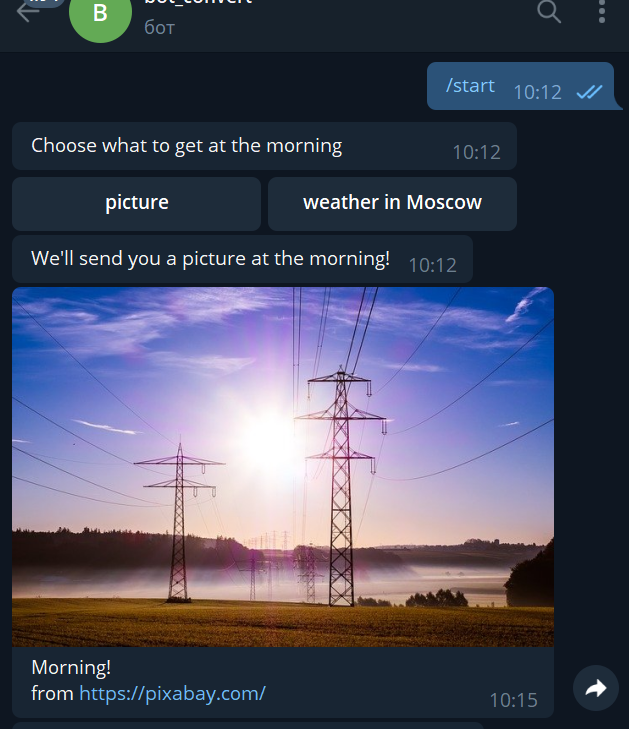

# Telegram Morning bot

## Description

Sends to a subscriber a random picture or a temperature in Moscow at the morning. Asks a user to choose one of those options (the choice can be changed).

## Usage

To start a bot user types `/start`.

Then he gets a telegram-*keyboard* with options what morning information he wants to receive from bot.



## Purpose

The project make for educational purpose to use a structure of classes, api-requests, asyncio library, sqlite3 database. 

## Structure

```py
morning_bot
	morning_bot.py          # main funcion for running the program
	.env.example            # environmental variables - token for 
                                # telegram and sites.

	config.py                #  
	morning_determiner.py 
	sender.py	         # calls methods from other classes to send morning data to users
	switcher.py		 # switch choice**
	tg_chats.py		 # sends requests to api.telegram.org*
	choices_records.py	 # to keep track of user choices in db
	fetchers/
		- __init__.py
		* pic_manager.py
		* site_pixabay.py
		* temperature_manager.py
		* site_openweathermap.py

* methods as sendMessage, getUpdates
** returns an instanse of TemperatureManager or PictureManager
```


